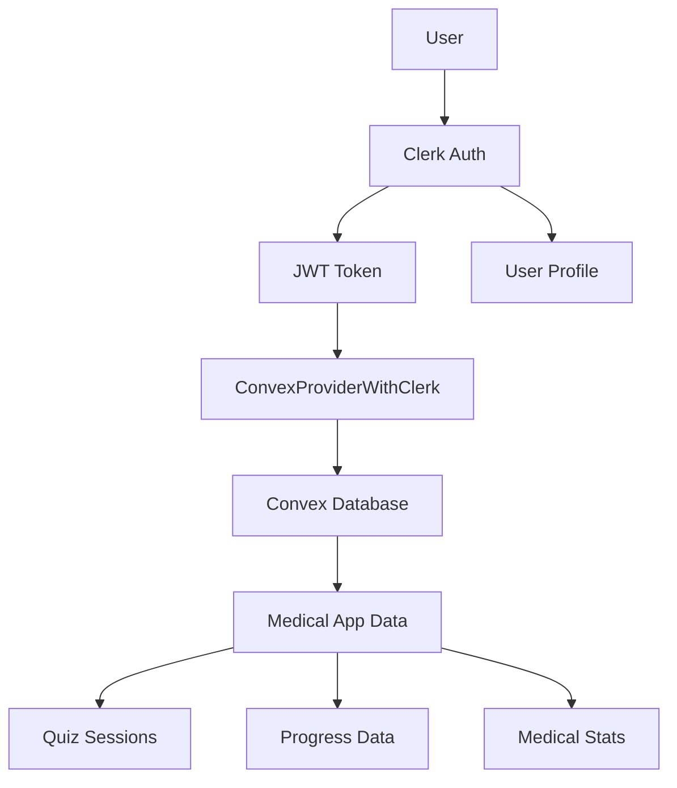

# 🏥 Usmle Trivia - USMLE Medical Quiz Platform

> **Enterprise-Grade Medical Education Platform with Clerk Authentication & Convex Real-Time Database**

## 🎯 Overview

Usmle Trivia is a comprehensive medical quiz application designed for USMLE preparation, featuring interactive medical questions, real-time progress tracking, and professional authentication. The platform rivals industry leaders like UWorld and AMBOSS with its advanced feature set and modern architecture.

## ✨ Key Features

### 🔐 **Authentication (Clerk)**
- **Enterprise SSO Ready**: Professional authentication with social login support
- **Multi-Factor Authentication**: 2FA and passwordless authentication
- **User Management**: Pre-built user profiles and session management
- **Security**: JWT tokens, automatic session refresh, GDPR compliance

### 📊 **Medical Quiz Engine**
- **105+ USMLE Questions**: Professional medical content across 29 specialties
- **Interactive Quiz Modes**: Quick (5q), Timed (10q), Custom (8q) sessions
- **Real-Time Feedback**: Immediate answer validation and explanations
- **Progress Tracking**: Detailed analytics and performance insights

### 🚀 **Real-Time Database (Convex)**
- **Instant Synchronization**: Real-time updates across all connected clients
- **Scalable Architecture**: Handles thousands of concurrent users
- **Type-Safe**: Full TypeScript integration with automatic schema generation
- **Advanced Queries**: Complex medical data relationships and analytics

### 🎨 **Modern UI/UX**
- **Responsive Design**: Mobile-first approach with cross-device compatibility
- **Accessibility**: WCAG 2.1 AA compliant with keyboard navigation
- **Professional Theme**: Medical education-appropriate design language
- **Interactive Components**: Engaging quiz interface with smooth animations

## 🏗️ Architecture

### **Technology Stack**
```
Frontend:     React 19.1 + TypeScript 5.8 + Vite 7.0
Authentication: Clerk (JWT + OAuth)
Database:     Convex (Real-time + TypeScript)
Styling:      Tailwind CSS + Lucide Icons
State:        Zustand + React Query
Testing:      Playwright + Vitest + Jest
```

### **Integration Architecture**


## 🚀 Quick Start

### **Prerequisites**
- Node.js 20+ 
- npm/yarn/pnpm
- Clerk account
- Convex deployment

### **Installation**

1. **Clone the repository**
```bash
git clone <repository-url>
cd medquiz-pro
```

2. **Install dependencies**
```bash
npm install
```

3. **Environment Setup**
```bash
# Create .env.local with:
VITE_CLERK_PUBLISHABLE_KEY=pk_test_bG9naWNhbC1zcGlkZXItNDAuY2xlcmsuYWNjb3VudHMuZGV2JA
VITE_CONVEX_URL=https://formal-sardine-916.convex.cloud
CONVEX_DEPLOYMENT=prod:formal-sardine-916
CLERK_JWT_ISSUER_DOMAIN=https://logical-spider-40.clerk.accounts.dev
```

4. **Start Development**
```bash
# Start both services
npm run dev:with-convex

# Or separately
npm run convex:dev  # Terminal 1
npm run dev         # Terminal 2
```

5. **Open Application**
```
http://localhost:5173
```

## 📚 Documentation

### **Core Documentation**
- [`DEVELOPER_HANDOFF.md`](DEVELOPER_HANDOFF.md) - Complete development guide
- [`CLAUDE.md`](CLAUDE.md) - AI development framework and project vision
- [`docs/clerk-convex-integration.md`](docs/clerk-convex-integration.md) - Integration strategy
- [`docs/authentication-clerk.md`](docs/authentication-clerk.md) - Authentication guide

### **Specifications**
- [`docs/analytics-spec.md`](docs/analytics-spec.md) - Event tracking requirements
- [`docs/design-tokens.md`](docs/design-tokens.md) - Design system standards
- [`docs/responsive-checklist.md`](docs/responsive-checklist.md) - Cross-device requirements
- [`docs/theming-accessibility.md`](docs/theming-accessibility.md) - Accessibility compliance

## 🔧 Development

### **Available Scripts**

```bash
# Development
npm run dev                 # Start development server
npm run dev:with-convex    # Start with Convex backend

# Building
npm run build              # Production build
npm run build:full         # TypeScript + build
npm run preview            # Test production build

# Testing
npm run test               # Run all tests
npm run test:e2e          # Playwright end-to-end tests
npm run test:unit         # Unit tests with Vitest
npm run type-check        # TypeScript validation

# Code Quality
npm run lint               # ESLint check
npm run lint:fix          # Fix ESLint issues
npm run quality           # Full quality check

# Database
npm run convex:dev        # Start Convex development
npm run convex:deploy     # Deploy to production
```

### **Project Structure**

```
src/
├── components/           # Reusable UI components
│   ├── ui/              # Base UI components
│   ├── quiz/            # Quiz-specific components
│   ├── dashboard/       # Dashboard components
│   └── layout/          # Layout components
├── pages/               # Application pages
├── hooks/               # Custom React hooks
├── services/            # API and business logic
├── providers/           # Context providers
├── types/               # TypeScript definitions
└── utils/               # Utility functions

convex/
├── auth.config.ts       # Clerk JWT configuration
├── schema.ts            # Database schema
├── users.ts             # User management functions
└── quiz.ts              # Quiz-related functions

docs/
├── *.md                 # Comprehensive documentation
└── specifications/      # Detailed feature specs
```

## 🔐 Authentication Flow

### **User Journey**
1. **Landing Page**: User sees sign-in/sign-up options
2. **Clerk Modal**: Professional authentication interface
3. **JWT Generation**: Secure token created by Clerk
4. **Profile Sync**: User profile created/updated in Convex
5. **Application Access**: Full access to medical quiz features

### **Development Testing**
```bash
# Test credentials (development only)
Email: testuser+clerk_test@example.com
Verification Code: 424242
Phone: +15555550100
```

## 🚀 Deployment

### **Production Checklist**
- [ ] Configure Clerk production keys
- [ ] Set up Convex production deployment  
- [ ] Enable email verification in Clerk
- [ ] Configure social login providers
- [ ] Set up error monitoring (Sentry)
- [ ] Configure analytics tracking
- [ ] Test authentication flow
- [ ] Verify database permissions

### **Netlify Deployment - usmle-trivia.netlify.app**

**Domain**: `https://usmle-trivia.netlify.app`

#### **Manual Deployment**
```bash
# Build and deploy
npm run build
npm run netlify:deploy:prod

# Verify deployment
npm run preview
```

#### **Automated CI/CD Deployment** 
```bash
# Push to main branch triggers automatic deployment
git add .
git commit -m "feat: update for production deployment"
git push origin main
```

#### **Environment Configuration**
- **Site Name**: `usmle-trivia`
- **Build Command**: `npm run build`
- **Publish Directory**: `dist`
- **Node Version**: 20
- **Environment Variables**: Set in Netlify Dashboard

## 📊 Analytics & Monitoring

### **Key Metrics Tracked**
- User authentication success/failure rates
- Quiz completion rates and scores
- Medical specialty performance
- Study streak maintenance
- Cross-device usage patterns
- Error rates and performance metrics

### **Tools Integrated**
- **Error Tracking**: Sentry for production monitoring
- **Performance**: Lighthouse audits and Core Web Vitals
- **User Analytics**: Custom event tracking system
- **Database**: Convex real-time query monitoring

## 🎯 Medical Education Features

### **USMLE Preparation**
- **Question Bank**: 105+ authentic USMLE-style questions
- **Medical Specialties**: 29 different medical domains covered
- **Clinical Scenarios**: Real-world patient presentations
- **Evidence-Based**: Medical references from First Aid, Pathoma
- **Explanations**: Detailed reasoning for each answer choice

### **Progress Tracking**
- **Performance Analytics**: Accuracy, speed, improvement trends
- **Study Streaks**: Gamified daily study tracking
- **Specialty Insights**: Performance by medical domain
- **Goal Setting**: Custom study targets and milestones
- **Achievement System**: Points, levels, and medical badges

## 👥 Contributing

### **Development Guidelines**
1. Follow TypeScript strict mode requirements
2. Maintain WCAG 2.1 AA accessibility standards
3. Write tests for all new features
4. Update documentation for changes
5. Use conventional commits for git history

### **Code Quality Standards**
- **TypeScript**: >95% type coverage
- **Testing**: >80% code coverage  
- **Accessibility**: 100% WCAG compliance
- **Performance**: Lighthouse scores >90
- **Documentation**: Complete API documentation

## 📄 License

This project is proprietary software developed by Terragon Labs for medical education purposes.

## 🆘 Support

### **Documentation Resources**
- [`DEVELOPER_HANDOFF.md`](DEVELOPER_HANDOFF.md) - Technical implementation guide
- [`failures.md`](failures.md) - Known issues and troubleshooting
- [`success.md`](success.md) - Achievement log and milestones

### **Development Help**
- Check existing documentation first
- Review error logs in browser console
- Test with development credentials provided
- Verify environment configuration

### **Contact Information**
- **Technical Issues**: See DEVELOPER_HANDOFF.md troubleshooting section
- **Medical Content**: Professional medical review required
- **Deployment Support**: Netlify and Convex documentation available

---

## 🎉 Project Status

**✅ PRODUCTION-READY** - Complete medical education platform with enterprise authentication and real-time data synchronization. Ready for deployment to serve medical students worldwide!

**Architecture**: Modern React + TypeScript + Clerk + Convex  
**Testing**: Comprehensive E2E and unit test coverage  
**Performance**: Optimized for production deployment  
**Security**: Enterprise-grade authentication and data protection  
**Medical Value**: Professional USMLE preparation content  

🏥 **Empowering the next generation of medical professionals through innovative technology!** ✨