# 🧠 MedQuiz Pro - Logic Map & Application Flow

## 📋 VCT Framework - Application Logic and Flow Documentation

**Last Updated**: August 5, 2025  
**Framework**: Visual Code Testing (VCT)  
**Status**: Production Application with Comprehensive Logic Documentation  

---

## 🎯 Logic Map Status: COMPLETE SYSTEM ARCHITECTURE ✅

**Application Flow**: End-to-end user journey mapped and documented  
**Business Logic**: All core medical education workflows defined  
**Data Flow**: Database operations and state management documented  
**Error Handling**: Comprehensive error scenarios and recovery paths  

---

## 🏗️ Application Architecture Overview

### **High-Level System Architecture**:

```mermaid
graph TB
    User[👤 Medical Student User]
    Frontend[🖥️ React Frontend]
    State[🧠 Zustand State Management]
    ConvexDB[(🗄️ Convex Database)]
    AppwriteDB[(🗄️ Appwrite Backup)]
    
    User --> Frontend
    Frontend --> State
    State --> ConvexDB
    State --> AppwriteDB
    
    Frontend --> Auth[🔐 Authentication]
    Frontend --> Quiz[🎯 Quiz Engine]
    Frontend --> Dashboard[📊 Dashboard]
    Frontend --> Profile[👤 User Profile]
    
    Auth --> ConvexDB
    Quiz --> ConvexDB
    Dashboard --> ConvexDB
    Profile --> ConvexDB
```


### **Core Application Layers**:
- **Presentation Layer**: React 19.1 components with TypeScript
- **State Management**: Zustand with real-time Convex subscriptions
- **Business Logic**: Service layer with medical education rules
- **Data Persistence**: Dual backend (Convex primary, Appwrite backup)
- **External Integrations**: MCP servers for development and monitoring

---

## 🔐 Authentication Logic Flow

### **User Registration Process**:

```mermaid
flowchart TD
    Start([👤 New User Visits]) --> Landing{🏠 Landing Page}
    Landing --> GetStarted[📝 Click Get Started]
    GetStarted --> Register[📋 Registration Form]
    
    Register --> Validate{✅ Form Validation}
    Validate -->|Invalid| ShowError[❌ Show Validation Errors]
    ShowError --> Register
    
    Validate -->|Valid| CreateUser[🔄 Create User Account]
    CreateUser --> ConvexAuth{🗄️ Convex Registration}
    
    ConvexAuth -->|Success| SetupProfile[👤 Complete Profile Setup]
    ConvexAuth -->|Error| AppwriteFallback[🔄 Appwrite Fallback]
    
    AppwriteFallback -->|Success| SetupProfile
    AppwriteFallback -->|Error| RegError[❌ Registration Failed]
    
    SetupProfile --> Dashboard[📊 Redirect to Dashboard]
    RegError --> Register
    
    Dashboard --> Welcome[🎉 Welcome Experience]
```


### **Authentication Service Logic**:
```typescript
// Authentication flow implementation
class AuthService {
  async register(userData: UserRegistrationData) {
    try {
      // Primary: Convex registration
      const convexUser = await this.convexAuth.createUser(userData);
      
      // Setup user profile
      await this.setupUserProfile(convexUser.id, userData);
      
      // Initialize user statistics
      await this.initializeUserStats(convexUser.id);
      
      return { success: true, user: convexUser };
      
    } catch (convexError) {
      // Fallback: Appwrite registration
      try {
        const appwriteUser = await this.appwriteAuth.createUser(userData);
        await this.syncUserToConvex(appwriteUser); // Background sync
        return { success: true, user: appwriteUser };
        
      } catch (appwriteError) {
        return { 
          success: false, 
          error: 'Registration failed. Please try again.' 
        };
      }
    }
  }
  
  async login(email: string, password: string) {
    // Similar dual-backend login logic
    return this.authenticateUser(email, password);
  }
}
```

---

## 🎯 Quiz Engine Logic Flow

### **Quiz Session Workflow**:

```mermaid
flowchart TD
    Dashboard[📊 User Dashboard] --> SelectMode{🎯 Quiz Mode Selection}
    
    SelectMode --> Quick[⚡ Quick Quiz - 5 Questions]
    SelectMode --> Timed[⏰ Timed Practice - 10 Questions]
    SelectMode --> Custom[🎛️ Custom Quiz - Variable]
    
    Quick --> LoadQuestions[📚 Load Random Questions]
    Timed --> LoadQuestions
    Custom --> LoadQuestions
    
    LoadQuestions --> InitSession[🔄 Initialize Quiz Session]
    InitSession --> StartTimer{⏱️ Start Timer?}
    
    StartTimer -->|Timed Mode| Timer[⏰ Start Countdown]
    StartTimer -->|Untimed| Question1[❓ Display First Question]
    Timer --> Question1
    
    Question1 --> AnswerSelect{🖱️ User Selects Answer}
    AnswerSelect --> SaveAnswer[💾 Save Answer to Session]
    SaveAnswer --> CheckProgress{📊 More Questions?}
    
    CheckProgress -->|Yes| NextQuestion[➡️ Next Question]
    CheckProgress -->|No| CalculateScore[🧮 Calculate Results]
    
    NextQuestion --> QuestionN[❓ Display Next Question]
    QuestionN --> AnswerSelect
    
    CalculateScore --> ShowResults[📊 Display Results]
    ShowResults --> SaveSession[💾 Save Completed Session]
    SaveSession --> UpdateStats[📈 Update User Statistics]
    UpdateStats --> ResultsPage[🎉 Results & Analytics]
    
    ResultsPage --> RetryOption{🔁 User Action}
    RetryOption --> NewQuiz[🆕 Start New Quiz]
    RetryOption --> Dashboard
    RetryOption --> ReviewAnswers[📖 Review Explanations]
    
    NewQuiz --> SelectMode
    ReviewAnswers --> ResultsPage
```


### **Quiz Engine Business Logic**:
```typescript
// Quiz session management
class QuizEngine {
  async startQuizSession(mode: QuizMode, userId: string) {
    // 1. Load appropriate questions based on mode
    const questions = await this.loadQuestions(mode);
    
    // 2. Create quiz session record
    const session = await this.createQuizSession({
      userId,
      mode,
      questionIds: questions.map(q => q.id),
      status: 'active',
      startTime: Date.now()
    });
    
    // 3. Initialize quiz state
    return {
      sessionId: session.id,
      questions: questions.map(q => this.sanitizeQuestion(q)), // Remove correct answers
      currentQuestion: 0,
      answers: new Array(questions.length).fill(null),
      timeLimit: this.getTimeLimit(mode),
      startTime: Date.now()
    };
  }
  
  async submitAnswer(sessionId: string, questionIndex: number, answer: number) {
    // 1. Validate answer submission
    if (!this.isValidAnswer(answer, questionIndex)) {
      throw new Error('Invalid answer submission');
    }
    
    // 2. Save answer to session
    await this.updateQuizSession(sessionId, {
      [`answers.${questionIndex}`]: answer,
      lastAnswered: Date.now()
    });
    
    // 3. Check if quiz is complete
    const session = await this.getQuizSession(sessionId);
    const isComplete = this.checkQuizComplete(session);
    
    if (isComplete) {
      return this.completeQuizSession(sessionId);
    }
    
    return { success: true, isComplete: false };
  }
  
  async completeQuizSession(sessionId: string) {
    // 1. Calculate final score
    const session = await this.getQuizSession(sessionId);
    const questions = await this.getQuizQuestions(session.questionIds);
    const score = this.calculateScore(session.answers, questions);
    
    // 2. Update session with results
    await this.updateQuizSession(sessionId, {
      status: 'completed',
      score,
      completedAt: Date.now(),
      timeSpent: Date.now() - session.startTime
    });
    
    // 3. Update user statistics
    await this.updateUserStats(session.userId, {
      totalQuizzes: { increment: 1 },
      totalPoints: { increment: this.calculatePoints(score) },
      accuracy: { recalculate: true }
    });
    
    return {
      score,
      totalQuestions: questions.length,
      correctAnswers: this.countCorrectAnswers(session.answers, questions),
      timeSpent: Date.now() - session.startTime,
      explanations: this.getExplanations(questions, session.answers)
    };
  }
}
```

---

## 📊 Data Flow Architecture

### **State Management Flow**:

```mermaid
flowchart LR
    UI[🖥️ React Components] --> Actions[⚡ User Actions]
    Actions --> Store[🧠 Zustand Store]
    Store --> Services[🔧 Service Layer]
    
    Services --> ConvexDB[(🗄️ Convex)]
    Services --> AppwriteDB[(🗄️ Appwrite)]
    
    ConvexDB --> Subscriptions[📡 Real-time Subscriptions]
    Subscriptions --> Store
    Store --> UI
    
    subgraph "State Slices"
        AuthState[🔐 Auth State]
        QuizState[🎯 Quiz State]
        UserState[👤 User State]
        UIState[🎨 UI State]
    end
    
    Store --> AuthState
    Store --> QuizState
    Store --> UserState
    Store --> UIState
```


### **Database Operation Patterns**:
```typescript
// Zustand store with Convex integration
const useAppStore = create<AppState>()(
  subscribeWithSelector((set, get) => ({
    // Authentication state
    user: null,
    isAuthenticated: false,
    authLoading: false,
    
    // Quiz state
    currentQuiz: null,
    quizHistory: [],
    quizLoading: false,
    
    // Actions with real-time sync
    login: async (email: string, password: string) => {
      set({ authLoading: true });
      
      try {
        const result = await authService.login(email, password);
        
        if (result.success) {
          set({ 
            user: result.user, 
            isAuthenticated: true,
            authLoading: false 
          });
          
          // Subscribe to user updates
          convexSubscriptions.subscribeToUser(result.user.id);
        }
        
        return result;
      } catch (error) {
        set({ authLoading: false });
        throw error;
      }
    },
    
    startQuiz: async (mode: QuizMode) => {
      set({ quizLoading: true });
      
      const { user } = get();
      if (!user) throw new Error('User not authenticated');
      
      try {
        const quiz = await quizService.startQuiz(mode, user.id);
        set({ 
          currentQuiz: quiz,
          quizLoading: false 
        });
        
        return quiz;
      } catch (error) {
        set({ quizLoading: false });
        throw error;
      }
    }
  }))
);
```

---

## 🔍 Error Handling Logic

### **Error Classification and Recovery**:

```mermaid
flowchart TD
    Error[❌ Error Occurs] --> Classify{🔍 Error Classification}
    
    Classify --> NetworkError[🌐 Network Error]
    Classify --> AuthError[🔐 Authentication Error]
    Classify --> ValidationError[✅ Validation Error]
    Classify --> DatabaseError[🗄️ Database Error]
    Classify --> UnknownError[❓ Unknown Error]
    
    NetworkError --> RetryLogic[🔄 Automatic Retry]
    RetryLogic --> RetrySuccess[✅ Retry Successful]
    RetryLogic --> RetryFailed[❌ Max Retries Exceeded]
    
    AuthError --> RefreshToken[🔑 Refresh Authentication]
    RefreshToken --> AuthSuccess[✅ Auth Refreshed]
    RefreshToken --> ForceLogin[🚪 Force Re-login]
    
    ValidationError --> ShowUserError[👤 Display User-Friendly Message]
    
    DatabaseError --> FallbackDB[🔄 Switch to Backup Database]
    FallbackDB --> FallbackSuccess[✅ Fallback Successful]
    FallbackDB --> CriticalError[🚨 Critical System Error]
    
    UnknownError --> LogError[📝 Log for Investigation]
    LogError --> GracefulDegradation[🛡️ Graceful Degradation]
    
    RetrySuccess --> ContinueFlow[➡️ Continue Normal Flow]
    AuthSuccess --> ContinueFlow
    ShowUserError --> UserCorrection[👤 User Corrects Input]
    FallbackSuccess --> ContinueFlow
    
    RetryFailed --> UserNotification[📱 Notify User of Issue]
    ForceLogin --> LoginPage[🚪 Redirect to Login]
    CriticalError --> MaintenancePage[🔧 Maintenance Mode]
    GracefulDegradation --> LimitedFunctionality[⚡ Limited Functionality Mode]
```


### **HIPAA-Compliant Error Handling**:
```typescript
// Error handling service with privacy protection
class ErrorHandler {
  static handleError(error: Error, context: string, metadata?: any) {
    // 1. Sanitize error for logging (remove PII)
    const sanitizedError = this.sanitizeError(error, metadata);
    
    // 2. Log error for monitoring
    this.logError(sanitizedError, context);
    
    // 3. Determine user-facing message
    const userMessage = this.getUserFriendlyMessage(error);
    
    // 4. Handle specific error types
    switch (error.name) {
      case 'AuthenticationError':
        return this.handleAuthError(error);
      
      case 'NetworkError':
        return this.handleNetworkError(error);
      
      case 'ValidationError':
        return this.handleValidationError(error, userMessage);
      
      case 'DatabaseError':
        return this.handleDatabaseError(error);
      
      default:
        return this.handleUnknownError(error, userMessage);
    }
  }
  
  private static sanitizeError(error: Error, metadata?: any) {
    return {
      name: error.name,
      message: error.message.replace(/\b[\w\.-]+@[\w\.-]+\.\w{2,4}\b/g, '[EMAIL_REDACTED]'),
      stack: error.stack?.split('\n')[0], // Only first line
      timestamp: Date.now(),
      context: metadata?.context,
      userId: metadata?.userId ? hashUserId(metadata.userId) : null,
      // No medical data or PII included
    };
  }
  
  private static getUserFriendlyMessage(error: Error): string {
    const friendlyMessages = {
      'NetworkError': 'Please check your internet connection and try again.',
      'AuthenticationError': 'Please log in again to continue.',
      'ValidationError': 'Please check your input and try again.',
      'DatabaseError': 'We\'re experiencing technical difficulties. Please try again shortly.',
      'QuizSubmissionError': 'Your quiz submission couldn\'t be saved. Please try again.',
    };
    
    return friendlyMessages[error.name] || 'Something went wrong. Please try again.';
  }
}
```

---

## 📈 User Experience Logic Flows

### **Dashboard Analytics Logic**:

```mermaid
flowchart TD
    UserLogin[👤 User Logs In] --> LoadDashboard[📊 Load Dashboard]
    LoadDashboard --> FetchUserStats[📈 Fetch User Statistics]
    
    FetchUserStats --> CalculateMetrics[🧮 Calculate Performance Metrics]
    CalculateMetrics --> StatsReady[✅ Statistics Ready]
    
    StatsReady --> DisplayCards[📋 Display Stats Cards]
    DisplayCards --> QuizHistory[📚 Load Recent Quiz History]
    QuizHistory --> ActivityFeed[📰 Generate Activity Feed]
    
    ActivityFeed --> Achievements[🏆 Check New Achievements]
    Achievements --> ProgressBars[📊 Update Progress Bars]
    ProgressBars --> Recommendations[🎯 Generate Study Recommendations]
    
    Recommendations --> DashboardComplete[✅ Dashboard Fully Loaded]
    
    subgraph "Real-time Updates"
        LiveStats[📡 Live Statistics Updates]
        NewAchievements[🎉 Achievement Notifications]
        StudyReminders[⏰ Study Reminders]
    end
    
    DashboardComplete --> LiveStats
    DashboardComplete --> NewAchievements
    DashboardComplete --> StudyReminders
```


### **Performance Analytics Calculation**:
```typescript
// User statistics calculation logic
class AnalyticsService {
  async calculateUserStats(userId: string) {
    // Fetch user's quiz sessions
    const sessions = await this.getUserQuizSessions(userId);
    
    if (sessions.length === 0) {
      return this.getDefaultStats();
    }
    
    // Calculate key metrics
    const stats = {
      totalQuizzes: sessions.length,
      averageScore: this.calculateAverageScore(sessions),
      accuracyTrend: this.calculateAccuracyTrend(sessions),
      timeSpentStudying: this.calculateTotalStudyTime(sessions),
      strongestCategories: this.findStrongestCategories(sessions),
      improvementAreas: this.findImprovementAreas(sessions),
      currentStreak: await this.calculateStudyStreak(userId),
      weeklyProgress: this.calculateWeeklyProgress(sessions),
      monthlyGoalProgress: this.calculateMonthlyProgress(sessions),
      levelProgress: this.calculateLevelProgress(sessions)
    };
    
    // Generate personalized recommendations
    stats.recommendations = this.generateRecommendations(stats);
    
    return stats;
  }
  
  private calculateAccuracyTrend(sessions: QuizSession[]) {
    // Calculate accuracy over time to show improvement
    const recentSessions = sessions.slice(-10); // Last 10 sessions
    const accuracyPoints = recentSessions.map((session, index) => ({
      x: index,
      y: session.score,
      date: session.completedAt
    }));
    
    return {
      data: accuracyPoints,
      trend: this.calculateTrendDirection(accuracyPoints),
      improvement: this.calculateImprovement(accuracyPoints)
    };
  }
  
  private generateRecommendations(stats: UserStats) {
    const recommendations = [];
    
    // Study frequency recommendations
    if (stats.currentStreak < 3) {
      recommendations.push({
        type: 'frequency',
        message: 'Try to study daily to build your streak!',
        action: 'start_quick_quiz'
      });
    }
    
    // Category-based recommendations
    if (stats.improvementAreas.length > 0) {
      recommendations.push({
        type: 'category',
        message: `Focus on ${stats.improvementAreas[0]} questions to improve`,
        action: 'start_category_quiz',
        category: stats.improvementAreas[0]
      });
    }
    
    // Performance-based recommendations  
    if (stats.averageScore < 70) {
      recommendations.push({
        type: 'difficulty',
        message: 'Try easier questions to build confidence',
        action: 'start_easy_quiz'
      });
    }
    
    return recommendations;
  }
}
```

---

## 🔄 Real-time Data Synchronization

### **Convex Real-time Subscription Logic**:

```mermaid
flowchart TD
    Component[⚛️ React Component] --> UseQuery[🔍 useQuery Hook]
    UseQuery --> ConvexClient[📡 Convex Client]
    ConvexClient --> Database[(🗄️ Convex Database)]
    
    Database --> DataChange[📊 Data Changes]
    DataChange --> Subscription[📡 Active Subscription]
    Subscription --> ClientUpdate[🔄 Client Update]
    ClientUpdate --> StateUpdate[🧠 State Update]
    StateUpdate --> Rerender[🖥️ Component Re-render]
    
    subgraph "Real-time Features"
        LiveScores[📊 Live Quiz Scores]
        InstantFeedback[⚡ Instant Answer Feedback]
        ProgressUpdates[📈 Progress Updates]
        AchievementAlerts[🏆 Achievement Notifications]
    end
    
    Rerender --> LiveScores
    Rerender --> InstantFeedback
    Rerender --> ProgressUpdates
    Rerender --> AchievementAlerts
```


### **Real-time Implementation**:
```typescript
// Real-time quiz session updates
function useQuizSession(sessionId: string) {
  // Real-time subscription to quiz session
  const session = useQuery(api.quiz.getSession, { sessionId });
  
  // Real-time subscription to user stats
  const userStats = useQuery(api.users.getUserStats, { 
    userId: session?.userId 
  });
  
  // Optimistic updates for better UX
  const mutation = useMutation(api.quiz.submitAnswer);
  
  const submitAnswer = useCallback(async (questionIndex: number, answer: number) => {
    // Optimistic update
    const optimisticSession = {
      ...session,
      answers: [...(session?.answers || [])],
    };
    optimisticSession.answers[questionIndex] = answer;
    
    // Update local state immediately
    setOptimisticSession(optimisticSession);
    
    try {
      // Submit to database
      await mutation({
        sessionId,
        questionIndex,
        answer,
        timestamp: Date.now()
      });
      
      // Real-time subscription will update with server response
    } catch (error) {
      // Revert optimistic update on error
      setOptimisticSession(null);
      throw error;
    }
  }, [session, sessionId, mutation]);
  
  return {
    session: optimisticSession || session,
    userStats,
    submitAnswer,
    isLoading: session === undefined
  };
}
```

---

## 🎯 Business Logic Rules

### **Medical Education Logic**:
```typescript
// Medical education business rules
class MedicalEducationRules {
  // Question difficulty progression
  static getDifficultyProgression(userLevel: number, accuracy: number) {
    if (userLevel < 5 || accuracy < 60) {
      return { easy: 60, medium: 30, hard: 10 };
    } else if (userLevel < 15 || accuracy < 80) {
      return { easy: 30, medium: 50, hard: 20 };
    } else {
      return { easy: 10, medium: 40, hard: 50 };
    }
  }
  
  // Spaced repetition algorithm
  static calculateNextReviewDate(
    previousScore: number, 
    consecutiveCorrect: number,
    difficulty: 'easy' | 'medium' | 'hard'
  ) {
    const baseInterval = {
      easy: 1,    // 1 day
      medium: 3,  // 3 days  
      hard: 7     // 7 days
    };
    
    const multiplier = Math.max(1, consecutiveCorrect);
    const scoreAdjustment = previousScore / 100;
    
    return baseInterval[difficulty] * multiplier * scoreAdjustment;
  }
  
  // Achievement system
  static checkAchievements(userStats: UserStats): Achievement[] {
    const newAchievements = [];
    
    // Study streak achievements
    if (userStats.currentStreak === 7) {
      newAchievements.push({
        id: 'week_streak',
        title: 'Week Warrior',
        description: '7 days of continuous study',
        points: 100
      });
    }
    
    // Accuracy achievements
    if (userStats.averageScore >= 90) {
      newAchievements.push({
        id: 'excellence',
        title: 'Excellence in Medicine',
        description: 'Maintain 90%+ average score',
        points: 200
      });
    }
    
    // Category mastery
    const masteredCategories = userStats.categoryStats.filter(
      cat => cat.accuracy >= 85 && cat.questionsAnswered >= 20
    );
    
    masteredCategories.forEach(category => {
      newAchievements.push({
        id: `master_${category.name}`,
        title: `${category.name} Master`,
        description: `85%+ accuracy in ${category.name}`,
        points: 150
      });
    });
    
    return newAchievements;
  }
}
```

---

## 🚀 Performance Optimization Logic

### **Loading and Caching Strategy**:

```mermaid
flowchart TD
    UserRequest[👤 User Request] --> CacheCheck{🗄️ Cache Check}
    
    CacheCheck -->|Hit| ServeCached[⚡ Serve from Cache]
    CacheCheck -->|Miss| FetchData[📡 Fetch from Database]
    
    FetchData --> ProcessData[🔄 Process Data]
    ProcessData --> UpdateCache[🗄️ Update Cache]
    UpdateCache --> ServeData[📤 Serve to User]
    
    ServeCached --> UserReceives[👤 User Receives Data]
    ServeData --> UserReceives
    
    subgraph "Caching Layers"
        BrowserCache[🌐 Browser Cache]
        ServiceWorker[⚙️ Service Worker]
        CDNCache[🌍 CDN Cache]
        DatabaseCache[🗄️ Database Cache]
    end
    
    UserReceives --> BrowserCache
    ServeData --> ServiceWorker
    ServeData --> CDNCache
    FetchData --> DatabaseCache
```


### **Lazy Loading Implementation**:
```typescript
// Component lazy loading for performance
import { lazy, Suspense } from 'react';

// Lazy load heavy components
const QuizEngine = lazy(() => import('./components/quiz/QuizEngine'));
const Dashboard = lazy(() => import('./pages/Dashboard'));
const Results = lazy(() => import('./components/quiz/QuizResults'));

// Route-based code splitting
const AppRouter = () => (
  <Router>
    <Routes>
      <Route path="/" element={<Landing />} />
      <Route 
        path="/dashboard" 
        element={
          <Suspense fallback={<LoadingSpinner />}>
            <Dashboard />
          </Suspense>
        } 
      />
      <Route 
        path="/quiz/:mode" 
        element={
          <Suspense fallback={<QuizLoadingSkeleton />}>
            <QuizEngine />
          </Suspense>
        } 
      />
    </Routes>
  </Router>
);

// Progressive data loading
const useProgressiveDataLoading = (userId: string) => {
  // Load critical data first
  const user = useQuery(api.users.get, { userId });
  
  // Load secondary data after user loads
  const stats = useQuery(
    api.users.getStats, 
    user ? { userId } : 'skip'
  );
  
  // Load tertiary data after stats load
  const achievements = useQuery(
    api.users.getAchievements,
    stats ? { userId } : 'skip'
  );
  
  return { user, stats, achievements };
};
```

---

## 🎉 Logic Map Excellence Summary

**MedQuiz Pro** demonstrates **comprehensive application logic** with:

### ✅ **Complete System Architecture**:
- End-to-end user journey mapping with decision points
- Comprehensive error handling with recovery strategies
- Real-time data synchronization and state management
- HIPAA-compliant privacy protection throughout all flows

### ✅ **Medical Education Business Logic**:
- Intelligent difficulty progression based on user performance
- Spaced repetition algorithms for optimal learning
- Achievement system driving engagement and motivation
- Performance analytics with personalized recommendations

### ✅ **Production-Grade Implementation**:
- Dual backend architecture with automatic failover
- Performance optimization with caching and lazy loading
- Type-safe operations with comprehensive validation
- Scalable architecture ready for growth and enhancement

**🧠 RESULT: A sophisticated, well-architected medical education platform with comprehensive logic flows ensuring excellent user experience, educational effectiveness, and system reliability!** 🏥✨